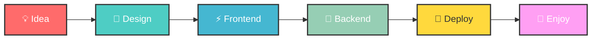

<!--  -->

# Hey 👋 What's up?

  
  <table width="100%">
    <tr>
      <td align="center" style="padding: 20px;">
        
          
        
        
        
      </td>
    </tr>
  </table>
  

# ✨ About me

✨ Coding since 2023 — turning ideas into digital reality.  
🎯 Goal: Launch impactful SaaS products that people love 🚀. 
🎲 Fun fact: Coffee + lo-fi beats = my secret coding fuel ☕🎶. 
💡 Mindset: Always learning, always building, always improving. 
🛠️ Favorite tools: Next.js, Node.js, Tailwind CSS, Figma, and VS Code. 

# 👨🏻‍💻I code with
###

  
  
  
  
  
  
  
  
  
  
  
  
  
  
  
  
  
  
  
  
  
  
  

###

# 🚀 My Development Workflow

# 🎯 Current Focus

- Building scalable SaaS applications with Next.js and TypeScript
- Exploring modern web technologies and best practices
- Creating content around full-stack development
- Contributing to open-source projects

---

  <table width="100%">
    <tr>
      <td align="center" style="padding: 20px;">
        
          
        
        
        
      </td>
    </tr>
  </table>

  

